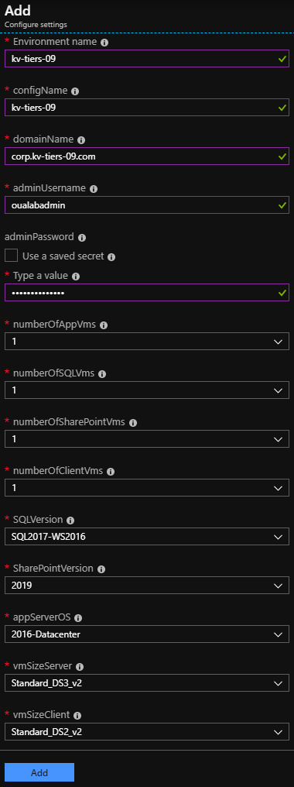
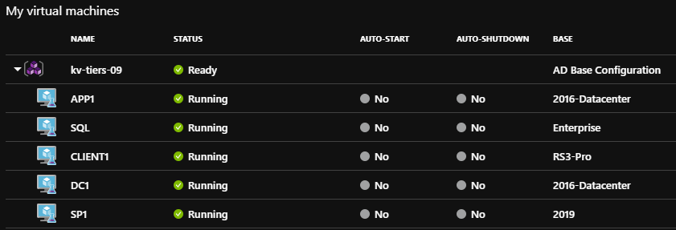

# Skunkworks Lab - 5-Tier AD Base Configuration v0.9 (BETA)

**Time to deploy**: 20-50 minutes, depending on complexity

&#x1F34E; **IMPORTANT!** This is a **BETA TEMPLATE** and has not been completely tested.

The **5-Tier AD Base Configuration** template provisions a flexible DevTest Lab test environment with a custom AD domain on an existing corpnet-connected ER circuit. You can choose to deploy the following five tiers (only the _AD DC_ tier is required):

+ AD DC
+ SQL Server
+ Application server
+ SharePoint Server
+ Windows 10 client

All server VMs can be deployed with Windows Server 2012 R2, 2016 or 2019, and all VMs are automatically joined to the custom AD domain.

## Usage

This template is intended for deployment in a **corpnet-connected DevTest lab**. You can deploy this template in the general-use [MAX-DTL-WCUS-01 DevTest lab](https://aka.ms/devtest1) by clicking the **Add+** button and selecting the base **5-Tier AD Base Configuration**:

### Example deployment configuration:

### Example deployment resources:

## Solution notes

+ Machine tier deployment notes:
  + **AD DC**: Windows Server VM configured as a domain controller and DNS
    + Users created: _User1_ (domain admin account), _sqlsvc_ (SQL service), and _spfarmsvc_ (SharePoint Farm service). These accounts all use the password you specify in the **adminPassword** field.
  + **SQL Server**: 0-1 Windows Server VM(s) with SQL Server **2014 SP3**, **2016 SP2** or **2017**
    + The name of the SQL Server VM is always **SQL._\<domain>_**.
    + You can only deploy a single SQL Server VM. SQL AlwaysOn is not available in this template.
    + SQL is configured with the default instance name SQL\\_MSSQLSERVER_ with TCP enabled on port **1433**.
    + The user account you specified in the deployment is used to create a local admin account on the SQL Server VM that belongs to the _sysadmin_ role. Other domain accounts are added as SQL logins in the sysadmin role by DSC: _\<domain>\domain admin account_, _\<domain>\sqlsvc_ and _\<domain>\spfarmsvc_.
  + **SharePoint Servers**: 0-_X_ Windows Server VM(s) with SharePoint Server **2013**, **2016** or **2019**
    + SharePoint is installed, but not configured. To provision SharePoint, either run the Configuration Wizard or use [AutoSPInstaller](https://autospinstaller.com).
      + Before deployment, check to make sure you choose a SQL Server version that is supported by the desired SharePoint Server version.
      + When configuring SharePoint, specify the database server SQL.<yourdomain>, and use the database access account _\<domain>\sqlsvc_ using the same password you specified for the admin account.
      + Use the service account _\<domain>\spsvc_ for the SharePoint Farm service.
    + You can navigate to SharePoint sites in your deployment from other VMs in the same deployment. If you want to navigate to your deployment's SharePoint sites from your work computer, you must add the SharePoint server's FQDN (i.e. _SP1.\<domain>.com_) and IP address to your work computer's HOSTS file (C:\Windows\system32\drivers\etc\hosts).
  + **App servers**: 0-_X_ Windows Server VM(s) for custom purposes
    + IIS is installed on each app server, and C:\Files containing the blank document _example.txt_ is shared as "Files".
    + Azure AD Connect is installed on the first app server only. APP1 will always be your DirSync server.
  + **Windows 10 clients**: 0-_X_ Windows 10 client VM(s). No special configuration other than joining to the local AD domain.

+ **General notes**:
  + During deployment, if the _Environment Name_ value is not unique within the DevTest Lab instance, Azure will append a series of numbers to the VM names in your deployment. These numbers are only appended to the VM names as shown in Azure, _not_ the machine hostnames.
  + The domain user *User1* is created in the domain and added to the Domain Admins group. User1's password is set to the value you provide in the _Admin Password_ parameter.
  + The other machine tier's VM resources depend on the **ADDC** resource deployment to ensure that the AD domain exists prior to execution of the JoinDomain extensions. The asymmetric VM deployment adds a few minutes to the overall deployment time.
  + Remember, when you RDP to your VM, you will use **domain\adminusername** for the custom domain of your environment, _not_ your corpnet credentials.

## Known issues

+ The client VM deployment may take longer than expected, and then appear to fail. The client VMs and extensions may or may not deploy successfully. This is due to an ongoing Azure client deployment bug, and only happens when the client VM size is smaller than DS3_v2.

___
Developed by the **MARVEL Skunkworks Lab**

Author: Kelley Vice (kvice@microsoft.com)  
https://github.com/maxskunkworks

Last update: _6/5/2019_

## Changelog

+ **8/8/2018**:  Original commit, derived from https://github.com/oualabadmins/lab_deploy/tree/master/max-base-config_x-vm.
+ **8/9/2018**:  Updates to output from nic.json to return DC IP value back to the main template for passing to linked app and client templates. This enables adding the DC IP to DNS settings on member VMs. Removed NSG to avoid inadvertently applying security rules to existing common virtual networks.
+ **1/16/2019**: Updated Win10 SKU to rs3-pro-test to match availability.
+ **1/23/2019**: Updated Win10 SKU to RS3-Pro - the other sku doesn't exist.
+ **5/7/2019**:  Reconfigured for use in corpnet DevTest labs.
+ **5/8/2019**:  Reconfigured DSC resources, added OU creation. Set member tiers to join to the custom OU to prevent joinDomain extension failures.
+ **5/14/2019**: Testing SQL & SP DSC
+ **5/21/2019**: Configured SQLConfig.ps1 to add new logins as type _WindowsUser_.
+ **5/22/2019**: Reconfigured DSC for SQL configuration. Previous DSC config was failing to log into SQL.
+ **5/23/2019**: Configured DSC to run BaseConfig script for all server VMs.
+ **6/5/2019**:  Updated DSC resources. BaseConfig now runs as a CSE; SQL is set to _Mixed_ login mode; DSC auth to SQL works as expected; added AAD Connect install to the AppConfig DSC configuration to install only on APP1.
